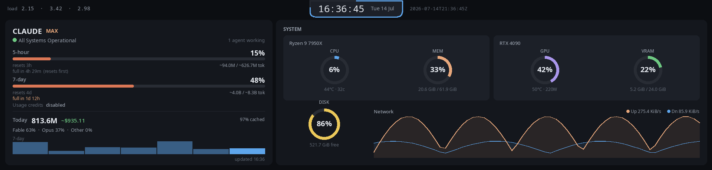

# trcc-monitor

Headless Claude-usage and system dashboard for the **Thermalright Trofeo Vision 9.16" LCD**
(1920×480 ultrawide). Replaces the KDE Plasma desktop widgets with an always-on hardware display,
running as a systemd user service.

It collects the same data the [Claude Limits KDE widget](https://www.opendesktop.org/p/2359310)
shows — rate-limit windows, local token usage/cost, active Claude Code sessions, service status —
plus system metrics (CPU, memory, disk, network, and GPU/VRAM via nvidia-smi or amdgpu sysfs),
renders a full dashboard frame, and pushes it to the LCD through the
[thermalright-trcc-linux](https://github.com/) daemon (`trccd`).

See [ROADMAP.md](ROADMAP.md) for the full plan and architecture.



*(1920×462, mock data — regenerate with `trcc-monitor preview --mock -o docs/preview.png`)*

## Status

Working today **without the LCD** (the display is on order):

- **Collectors** — all five data sources (limits, usage, sessions, status, system), threaded and
  fault-tolerant, testable against live data.
- **Renderer** — full 1920×462 dashboard via Pillow; `trcc-monitor preview` writes a PNG.
- **Sinks** — `PngSink` (works now) and `TrccdSink` (IPC + REST, written to the trccd contract).
- **Run loop** — `trcc-monitor run`: collect → render → push, with sink reconnect/backoff and
  graceful SIGTERM shutdown.
- **Service** — `install.sh` installs the package and a systemd user unit.

Pending hardware: end-to-end verification of the trccd sink against the physical panel, plus
orientation/brightness tuning. See [ROADMAP.md](ROADMAP.md) (milestone M2 onward).

## Install as a service

```bash
./install.sh                 # installs the package + systemd user unit, enables it
systemctl --user status trcc-monitor.service
journalctl --user -u trcc-monitor.service -f
```

The service pushes frames through the **trccd** daemon (thermalright-trcc-linux), which must be set
up first: `sudo trcc system setup` (udev + SELinux, one-time) then
`systemctl --user enable --now trccd.service`.

## Development

```bash
uv venv
uv pip install -e '.[dev]'
uv run pytest
uv run trcc-monitor preview --mock -o /tmp/dash.png   # design against synthetic data, no hardware
```

## Usage

```bash
# Poll all collectors once and print JSON (great for debugging).
trcc-monitor check

# (Phase 3) Render one dashboard frame to a PNG without any hardware.
trcc-monitor preview -o /tmp/dash.png
trcc-monitor preview --mock          # use synthetic data

# (Phase 3/4) Run the full collect → render → display loop.
trcc-monitor run
```

> **Note:** `trcc-monitor check` (and the `limits` collector generally) makes one real, minimal
> (`max_tokens: 1`) API call to `api.anthropic.com` each time it polls, which counts against your
> usage. The interval defaults to 5 minutes; all other collectors are local and free.

## Configuration

Optional TOML at `~/.config/trcc-monitor/config.toml` (or `$TRCC_MONITOR_CONFIG`). Everything has a
default; override only what you need. See [config.example.toml](config.example.toml) for the full
annotated set of keys, including `disk_path` (point this at your home mount on Bazzite/ostree, since
`/` reports a full read-only root) and the `[sink]` transport options.

## License

MIT
